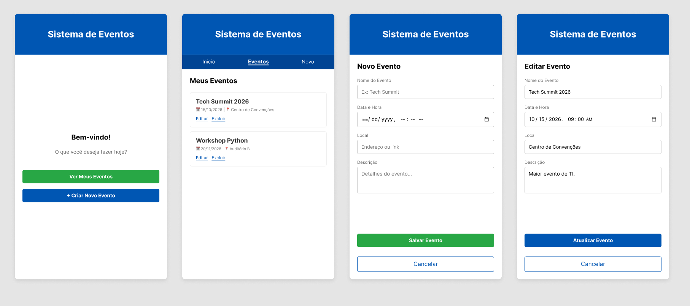

# MVP: Sistema de Gerenciamento de Eventos

## i) Descrição do Projeto
Este projeto é um Produto Mínimo Viável (MVP) desenvolvido para o gerenciamento do ciclo de vida de eventos. O sistema foi construído aplicando princípios de arquitetura de software limpa, separação de responsabilidades em camadas e persistência de dados.
**Tecnologias:** Python 3 (Backend), PostgreSQL (Modelagem Física) e HTML/CSS (Wireframing).

## ii) Explicação das Classes e Arquitetura
O código segue uma arquitetura baseada em camadas para garantir modularidade:
* **`models.Evento`**: Entidade de domínio. Encapsula os atributos (id, nome, data, local, descricao) usando getters e setters para garantir que os dados sejam válidos em sua origem.
* **`repositories.EventoRepository`**: Isola a lógica de acesso a dados. É a única classe que sabe como os eventos são armazenados e buscados.
* **`services.GerenciadorEventos`**: Atua como a camada de negócio. Orquestra a criação, leitura, atualização e deleção (CRUD), conectando os inputs à camada de persistência.

## iii) Projeto Físico do Banco de Dados
A modelagem física (`projeto_banco.sql`) estruturou a tabela `eventos` contendo as seguintes colunas e tipos: `id` (`SERIAL PRIMARY KEY` para IDs únicos), `nome` e `local` (`VARCHAR`), `data` (`TIMESTAMP` para precisão de data e hora) e `descricao` (`TEXT` para blocos maiores de informação).

**Justificativa de Índice:** Foi adicionado um `INDEX` na coluna `data`. Como sistemas de eventos lidam com cronologia constante (listar eventos do dia, eventos futuros), este índice otimiza o *query plan* do banco, acelerando as buscas por datas.

## iv) Wireframe e Sitemap
O fluxo de navegação do usuário foi desenhado para ser intuitivo e direto, possuindo quatro telas principais:
`Tela Inicial` ➔ `Listagem de Eventos` ➔ `Cadastro de Eventos` ou `Edição de Evento`.

Abaixo, segue a interface projetada (protótipo) contemplando todas as telas exigidas:

* **Tela Inicial:** Apresenta uma mensagem de boas-vindas e botões de acesso rápido para ver os eventos ou criar um novo.
* **Tela de Listagem (Meus Eventos):** Exibe os eventos cadastrados em formato de cards com informações resumidas (nome, data e local) e links diretos para Editar ou Excluir.
* **Tela de Cadastro (Novo Evento):** Formulário limpo para inserção de dados, contendo campos de texto, data/hora e área de descrição.
* **Tela de Edição:** Reaproveitamento do layout de cadastro, porém com os campos preenchidos com os dados atuais do evento e o botão de "Atualizar".

## v) Instruções de Execução
1. Certifique-se de ter o PostgreSQL rodando localmente.
2. Crie um banco de dados e rode o script `projeto_banco.sql` para criar a tabela.
3. Instale a dependência de conexão com o banco executando: `pip install psycopg2-binary`
4. Atualize as credenciais do banco no arquivo `main.py` (variável DB_CONFIG).
5. Execute o sistema com: `python main.py`